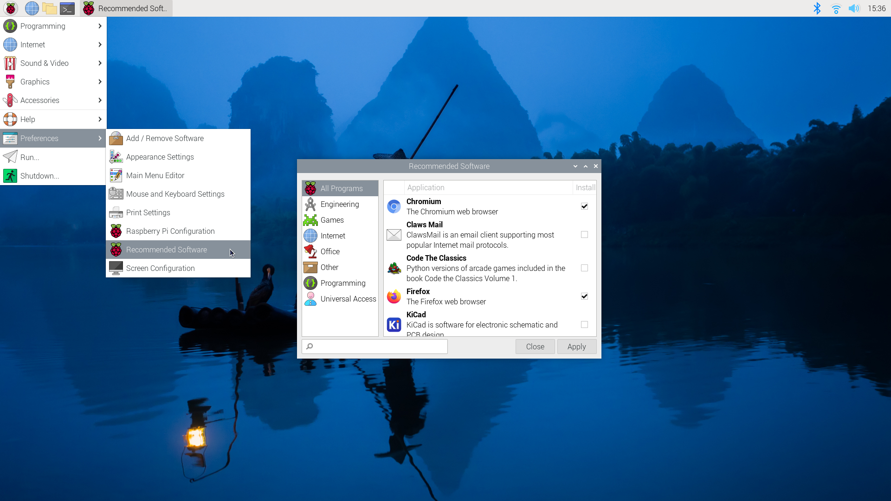

# Requisitos para Ejecutar Raspbian

#### Requerimientos Mínimos para Raspbian en la Última Raspberry Pi

Para garantizar una experiencia óptima con Raspbian en tu Raspberry Pi, es importante considerar los siguientes requerimientos mínimos. Esta información es esencial para aquellos que buscan aprovechar al máximo su dispositivo Raspberry Pi con el sistema operativo Raspbian. Asegúrate de revisar los detalles para la versión específica de Raspberry Pi que posees, ya que los requerimientos pueden variar ligeramente entre modelos.

| Requerimiento              | Especificaciones                                                                                                                                                |
| -------------------------- | --------------------------------------------------------------------------------------------------------------------------------------------------------------- |
| **Modelo de Raspberry Pi** | Última versión disponible (revisa el [sitio oficial](https://www.raspberrypi.com/documentation/computers/getting-started.html) para confirmar el modelo actual) |
| **Tarjeta MicroSD**        | Mínimo 8 GB, Clase 10 recomendada para un mejor rendimiento                                                                                                     |
| **Fuente de Alimentación** | Específica para el modelo de Raspberry Pi en uso, con el voltaje y amperaje adecuados                                                                           |
| **Conexión a Internet**    | Se recomienda para descargar actualizaciones y paquetes de software, ya sea por Ethernet o Wi-Fi dependiendo del modelo                                         |
| **Periféricos**            | Teclado y ratón USB, pantalla con conexión HDMI o adaptador compatible                                                                                          |
| **Carcasa**                | Opcional, pero recomendada para proteger el dispositivo                                                                                                         |

Para obtener más detalles sobre cómo configurar tu Raspberry Pi con Raspbian y asegurarte de que cumples con todos los requerimientos necesarios, visita la [documentación oficial de Raspberry Pi](https://www.raspberrypi.com/documentation/computers/getting-started.html).

#### Requisitos Mínimos para un PC convencional&#x20;

Aunque Raspbian es para las pacas de Raspberry Pi, es posible ejecutar este sistema operativo en un PC mediante máquinas virtuales. Esta flexibilidad permite explorar y jugar con el entorno de Raspbian sin necesidad de tener la placa de la Raspberry&#x20;

A continuación, se presentan los requisitos mínimos para correr Raspbian en un PC

| Requerimiento                  | Especificaciones Mínimas                                                                            |
| ------------------------------ | --------------------------------------------------------------------------------------------------- |
| **Sistema Operativo**          | Windows 7/8/10, Linux o macOS                                                                       |
| **Procesador**                 | 1 GHz o superior, con soporte para virtualización (Intel VT-x o AMD-V)                              |
| **Memoria RAM**                | 2 GB mínimo (4 GB recomendado para un rendimiento óptimo)                                           |
| **Espacio en Disco Duro**      | 5 GB de espacio libre para la instalación de Raspbian y datos adicionales                           |
| **Software de Virtualización** | Oracle VM VirtualBox, VMware Workstation Player, o similar compatible con el sistema operativo host |
| **Gráficos**                   | Tarjeta gráfica con soporte para renderizado 3D (para mejorar la experiencia de emulación)          |
| **Periféricos**                | Teclado y ratón; acceso a puertos USB si se requiere conectar dispositivos específicos              |

<figure><figcaption>
<strong>Figura No. 1.</strong> Interfaz de Usuario de Raspbian en Raspberry Pi. <strong>Fuente:</strong> Raspberry Pi Foundation (2024), https://www.raspberrypi.com/documentation/computers/getting-started.html
</figcaption></figure>

